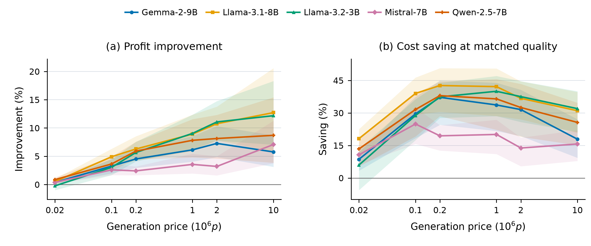

# Adaptive alignment: the current algorithm

The implementation is [adaptive_alignment.py](adaptive_alignment.py).
It implements the new DMRL-inspired empirical stopping rule,
not the older fitted-exponential policy in this repository.
It needs no training data or distribution fit. It uses only responses already
generated for the current prompt. FSFairX and RM-Mistral-7B are the evaluated
reward models; the stopping API accepts a scalar reward from either.

## Use with your generator

The class itself uses only the Python standard library (Python 3.10+).
From the repository root:

~~~python
from algorithm.adaptive_alignment import AdaptiveAlignment

policy = AdaptiveAlignment(price=1e-6, cap=960)  # dollars per output token
responses = []
while True:
    response, output_token_count = generate_response(prompt)
    reward = score_response(prompt, response)
    responses.append(response)
    decision = policy.observe(reward=reward, length=output_token_count)
    if decision.should_stop:
        answer = responses[decision.best_index]
        print("Calls:", decision.count, "Paid cost:", decision.total_cost)
        break
~~~

The generator and scorer in this example are your model integrations, not
functions supplied by this module. Record the actual generated token count,
with a consistent convention for special tokens. The policy never estimates
tokens from text length. The caller retains responses; best_index is zero-based
and selects the earliest response when rewards tie.

Defaults are four initial responses, a 0.99 reference quantile, and cost
adjustment beta=2. Maximum utility is valued at one dollar. Every response is
charged at the actual price, including the initial four and the final response.
The generation cap forces a return. Calling observe() after stopping raises
an error, and a new prompt requires a new policy instance.

## What the policy computes

At n responses, normalize observed scores as z_i=exp(r_i-max(r)).
Sort in descending order and take k=floor(n/2):

~~~text
cutoff = (k+1)-st largest z
excess = mean of the k largest values minus cutoff
reference = cutoff + excess * [1 + log((k/n)/(1-0.99))]
h(z) = z / (z + reference)

gain_n = [h(1+excess) - h(1)] / (n+1)
smoothed_gain = mean(t * gain_t for t=4,...,n) / n

mean_length = mean(observed lengths)
se = sample_standard_deviation(observed lengths) / sqrt(n)
estimated_cost = price * mean_length / (1 + 2*se/mean_length)

Stop when smoothed_gain <= estimated_cost, or the cap is reached.
Return the highest-reward response; pay price * sum(all observed lengths).
~~~

The tail excess estimates how much a new record could improve the response.
The Bradley–Terry map h converts this to utility relative to an estimated
high-quality reference. Smoothing stabilizes the estimated gain. Discounting
the estimated next cost encourages sampling while length estimates are uncertain;
it never discounts the cost reported in profit.

These are empirical estimates, not confidence bounds. The DMRL theorems motivate
gain-versus-cost stopping but do not certify this particular algorithm.
Settings were chosen during development on Alpaca/Mistral and frozen for
FSFairX; “no training” means no training fit at deployment, not no development.

## Results and reproduction

| Reward model | Mean profit gain over train-selected fixed N | Cost saving at matched quality |
|---|---:|---:|
| FSFairX | 5.55% | 27.73% |
| RM-Mistral-7B | 5.00% (4.998% before rounding) | 25.15% |

These average 30 generator–price settings per reward model. The historical
replays charge recorded character lengths, not tokenizer counts; token-cost
results must be regenerated. Matched-quality baselines are retrospective
mixtures selected on test data, not an online target-quality guarantee.

See [SERVER_HANDOFF.md](../SERVER_HANDOFF.md) for environment setup,
both reward-model replay commands, token-count input schema, and figure generation.
The public class is tested against the original replay gain estimates, cost
estimates, stopping counts, selected responses, and actual expenditure.
