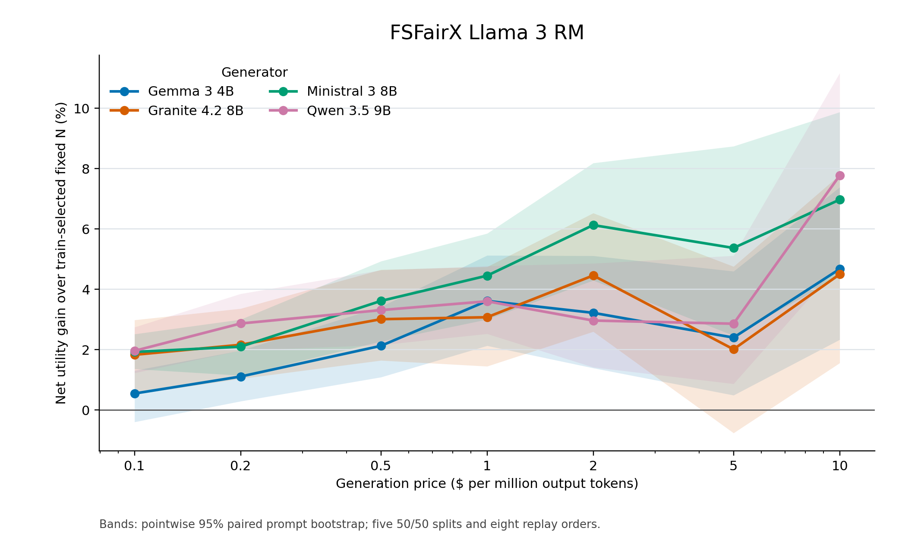
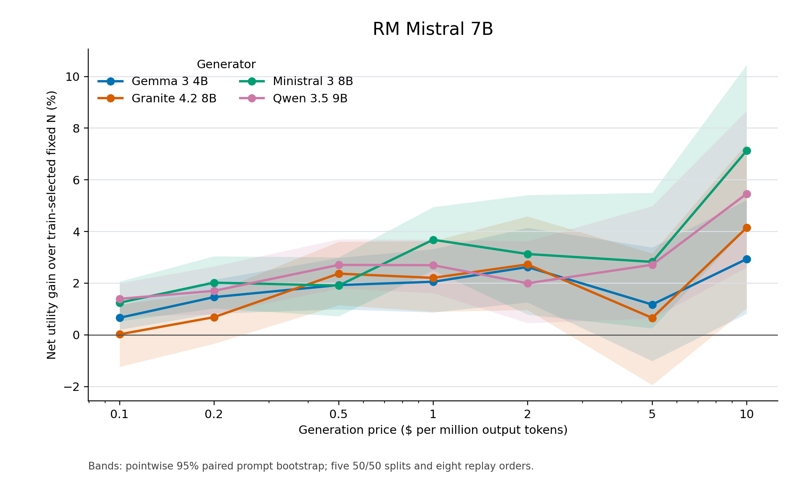

# Token-count DMRL alignment: adaptive versus train-selected fixed N

The adaptive policy is the frozen `AdaptiveAlignment mean_costse2` rule. Each fixed best-of-N baseline chooses one integer N on training prompts to maximize mean net utility at that cost multiplier, then uses that same N for every held-out prompt. Each table uses Qwen 3.5 9B; the figures show all four generators for FSFairX and RM-Mistral.

**Net utility (profit) = reward-based quality − generation cost.** Quality is sigmoid(selected reward minus the prompt's full-pool reward q99). Cost uses recorded output tokens at the illustrative price per million tokens. Reward scoring and input-token costs are excluded.

For each price and reward model, values average five 50/50 held-out split results. Mean fixed N can be fractional because a separate integer N was selected in each split. Percent gains and direct cost savings average the splitwise percentages, so they need not equal ratios of the displayed means. The same eight response orders are used for adaptive and fixed N. Qwen was chosen after inspecting earlier results, so this focus is exploratory.

## FSFairX Llama 3 RM

| $/M tokens | Fixed N | Fixed quality | Adaptive quality | Fixed cost ($) | Adaptive cost ($) | Fixed net utility | Adaptive net utility | Relative net utility gain | Direct cost saving |
|---:|---:|---:|---:|---:|---:|---:|---:|---:|---:|
| 0.1 | 482.0 | 0.5917 | 0.5958 | 0.03980 | 0.03308 | 0.5519 | 0.5627 | +1.96% | +15.1% |
| 0.2 | 231.4 | 0.5603 | 0.5755 | 0.03810 | 0.03836 | 0.5222 | 0.5372 | +2.87% | -2.4% |
| 0.5 | 103.4 | 0.5258 | 0.5438 | 0.04239 | 0.04441 | 0.4834 | 0.4994 | +3.31% | -5.2% |
| 1 | 66.4 | 0.5033 | 0.5135 | 0.05464 | 0.04858 | 0.4487 | 0.4649 | +3.61% | +10.0% |
| 2 | 32.6 | 0.4655 | 0.4769 | 0.05348 | 0.05267 | 0.4120 | 0.4243 | +2.97% | +1.4% |
| 5 | 18.6 | 0.4275 | 0.4191 | 0.07642 | 0.05794 | 0.3511 | 0.3612 | +2.86% | +23.7% |
| 10 | 10.2 | 0.3801 | 0.3838 | 0.08398 | 0.06463 | 0.2961 | 0.3191 | +7.77% | +22.7% |

## RM Mistral 7B

| $/M tokens | Fixed N | Fixed quality | Adaptive quality | Fixed cost ($) | Adaptive cost ($) | Fixed net utility | Adaptive net utility | Relative net utility gain | Direct cost saving |
|---:|---:|---:|---:|---:|---:|---:|---:|---:|---:|
| 0.1 | 531.6 | 0.6042 | 0.6002 | 0.04373 | 0.03187 | 0.5605 | 0.5683 | +1.39% | +26.0% |
| 0.2 | 279.0 | 0.5773 | 0.5777 | 0.04585 | 0.03724 | 0.5315 | 0.5405 | +1.70% | +18.5% |
| 0.5 | 112.2 | 0.5344 | 0.5449 | 0.04616 | 0.04339 | 0.4883 | 0.5015 | +2.71% | +5.2% |
| 1 | 73.4 | 0.5109 | 0.5106 | 0.06023 | 0.04777 | 0.4507 | 0.4628 | +2.70% | +20.5% |
| 2 | 35.6 | 0.4700 | 0.4719 | 0.05855 | 0.05215 | 0.4115 | 0.4197 | +2.00% | +10.0% |
| 5 | 17.2 | 0.4198 | 0.4158 | 0.07071 | 0.05730 | 0.3491 | 0.3585 | +2.71% | +17.5% |
| 10 | 9.0 | 0.3692 | 0.3746 | 0.07451 | 0.06377 | 0.2947 | 0.3108 | +5.46% | +11.9% |

Bands are pointwise 95% paired prompt-bootstrap intervals conditional on the fixed N selected from training, the frozen DMRL policy, and the exploratory generator choice. They are not simultaneous intervals.
