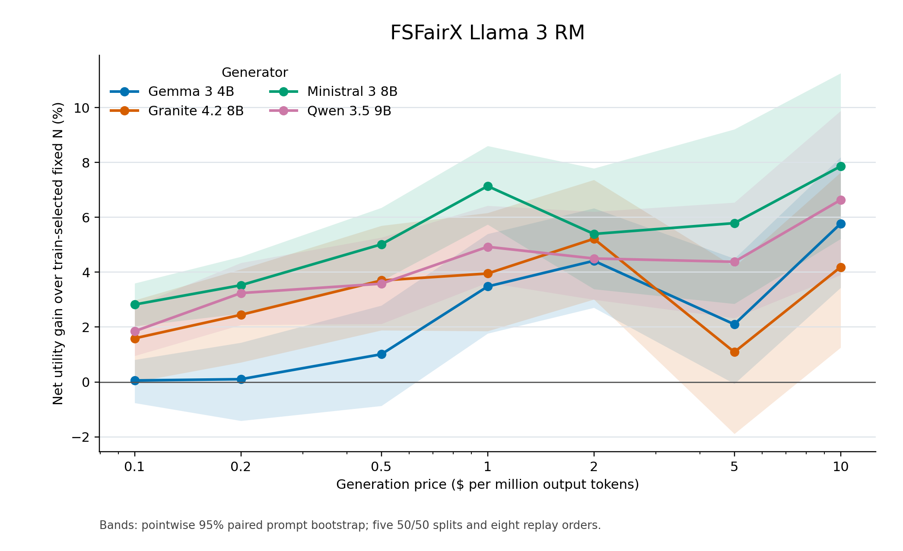
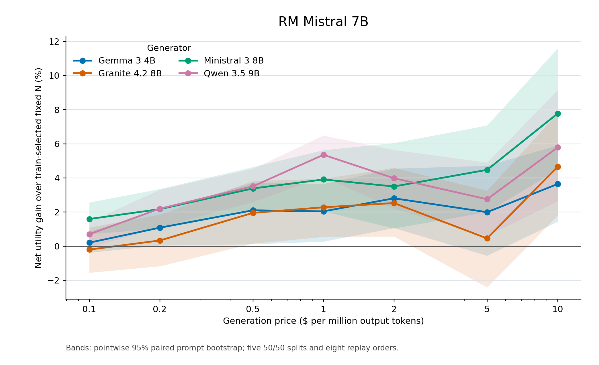

# Token-count Pandora alignment utility

This run uses the earlier training-free `local_exp_open5_conf06` Pandora tail policy on the new token-counted responses. Qwen 3.5 9B is held fixed in both tables; the two figures show all four generators. Prices are $0.1–$10 per million recorded output tokens.

**Correction:** the previous focused report labeled pre-cost reward quality as utility. Here **net utility = quality − generation cost**, matching the earlier alignment experiment's objective. The earlier 2–10% utility result used this Pandora policy, whereas the DMRL rule is a different algorithm.

For every generator, reward model, split, and price, training prompts select the single integer fixed N that maximizes mean net utility. That N is frozen on held-out prompts. The same eight response orders are used for adaptive and fixed N. Values average five 50/50 split results. Percent gains are averages of splitwise relative net utility gains; they need not equal a ratio of displayed means.

Quality is sigmoid(selected reward minus the prompt's full-pool reward q99). Generation cost uses actual recorded output tokens. Reward scoring and input-token costs are excluded. Prices are illustrative and quality is a reward-model proxy. Qwen was chosen after inspecting prior results, so its selection is exploratory.

## FSFairX Llama 3 RM

| $/M tokens | Fixed N | Fixed quality | Adaptive quality | Fixed cost ($) | Adaptive cost ($) | Fixed net utility | Adaptive net utility | Relative net utility gain | Direct cost saving |
|---:|---:|---:|---:|---:|---:|---:|---:|---:|---:|
| 0.1 | 482.0 | 0.5917 | 0.6088 | 0.03980 | 0.04668 | 0.5519 | 0.5621 | +1.85% | -19.9% |
| 0.2 | 231.4 | 0.5603 | 0.5907 | 0.03810 | 0.05162 | 0.5222 | 0.5391 | +3.24% | -38.2% |
| 0.5 | 103.4 | 0.5258 | 0.5580 | 0.04239 | 0.05729 | 0.4834 | 0.5007 | +3.58% | -35.9% |
| 1 | 66.4 | 0.5033 | 0.5281 | 0.05464 | 0.05730 | 0.4487 | 0.4708 | +4.93% | -6.4% |
| 2 | 32.6 | 0.4655 | 0.4900 | 0.05348 | 0.05939 | 0.4120 | 0.4306 | +4.50% | -11.2% |
| 5 | 18.6 | 0.4275 | 0.4238 | 0.07642 | 0.05733 | 0.3511 | 0.3665 | +4.38% | +24.5% |
| 10 | 10.2 | 0.3801 | 0.3790 | 0.08398 | 0.06317 | 0.2961 | 0.3158 | +6.64% | +24.4% |

## RM Mistral 7B

| $/M tokens | Fixed N | Fixed quality | Adaptive quality | Fixed cost ($) | Adaptive cost ($) | Fixed net utility | Adaptive net utility | Relative net utility gain | Direct cost saving |
|---:|---:|---:|---:|---:|---:|---:|---:|---:|---:|
| 0.1 | 531.6 | 0.6042 | 0.6103 | 0.04373 | 0.04582 | 0.5605 | 0.5644 | +0.70% | -6.6% |
| 0.2 | 279.0 | 0.5773 | 0.5897 | 0.04585 | 0.04662 | 0.5315 | 0.5431 | +2.20% | -2.1% |
| 0.5 | 112.2 | 0.5344 | 0.5547 | 0.04616 | 0.04929 | 0.4883 | 0.5054 | +3.51% | -8.0% |
| 1 | 73.4 | 0.5109 | 0.5265 | 0.06023 | 0.05171 | 0.4507 | 0.4748 | +5.35% | +13.9% |
| 2 | 35.6 | 0.4700 | 0.4852 | 0.05855 | 0.05730 | 0.4115 | 0.4279 | +3.98% | +0.8% |
| 5 | 17.2 | 0.4198 | 0.4160 | 0.07071 | 0.05729 | 0.3491 | 0.3587 | +2.75% | +17.4% |
| 10 | 9.0 | 0.3692 | 0.3752 | 0.07451 | 0.06340 | 0.2947 | 0.3118 | +5.79% | +12.2% |

The pointwise 95% paired prompt-bootstrap bands condition on the frozen policy, the training-selected fixed Ns, and the exploratory Qwen choice. They are not simultaneous or corrected for development-time selection.
