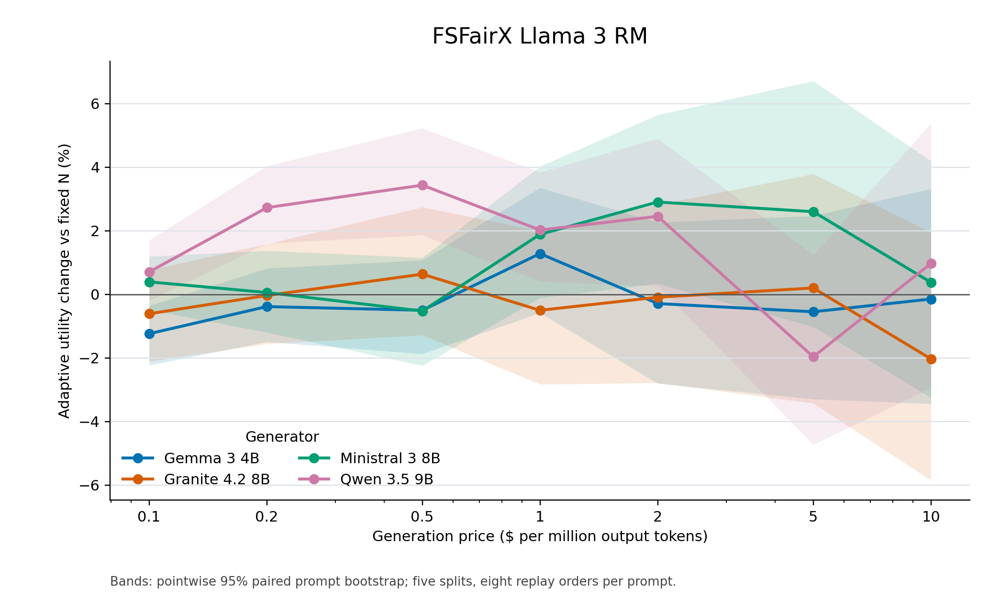
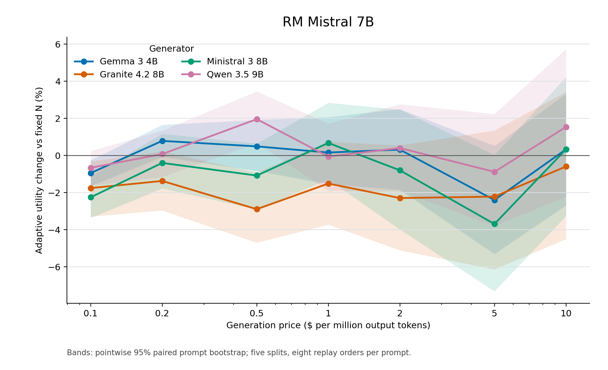

# Focused token-count alignment comparison

**Correction (2026-09-24):** The column and plots called “relative utility” below
measure relative reward quality *before* generation cost. For the requested
profit/utility comparison against a fixed N selected on training prompts and
held constant on test, use the [corrected DMRL report](../dmrl_fixed_n_net_utility_0p1_to_10_20260924/REPORT.md).
Its figures plot relative **net utility** gain, and its tables retain quality,
cost, and net utility as separate quantities. This older report remains here
only to preserve the original output.

Generator in both tables: **Qwen 3.5 9B**. Reward models: FSFairX and RM-Mistral. Prices: $0.1–$10 per million recorded output tokens.

Qwen was chosen after inspecting the earlier four-generator results: it was the most frequent training-selected generator across these reward models and prices and had higher average adaptive profit than Ministral. This choice is exploratory.

Fixed N is selected on training prompts separately for each split, reward model, and price. Entries average five held-out split results. Utility is sigmoid(selected reward minus the prompt's full-pool reward q99). Cost is generation output tokens times the price; reward scoring cost is excluded. Profit is utility minus generation cost. Prices are illustrative and utility is a reward-model proxy.

The figures keep all four generators and plot the mean splitwise relative utility change, 100 × (adaptive utility − fixed-N utility) / fixed-N utility. Bands are pointwise paired prompt-bootstrap intervals, conditional on selected fixed Ns and the exploratory generator choice.

## FSFairX Llama 3 RM

| $/M tokens | Fixed N | Fixed utility | Adaptive utility | Relative utility | Fixed cost ($) | Adaptive cost ($) | Fixed profit | Adaptive profit | Profit gain ($) | Direct cost saving | Matched-utility saving |
|---:|---:|---:|---:|---:|---:|---:|---:|---:|---:|---:|---:|
| 0.1 | 482.0 | 0.5917 | 0.5958 | +0.71% | 0.03980 | 0.03308 | 0.5519 | 0.5627 | +0.01083 | +15.1% | +21.6% |
| 0.2 | 231.4 | 0.5603 | 0.5755 | +2.73% | 0.03810 | 0.03836 | 0.5222 | 0.5372 | +0.01498 | -2.4% | +28.2% |
| 0.5 | 103.4 | 0.5258 | 0.5438 | +3.43% | 0.04239 | 0.04441 | 0.4834 | 0.4994 | +0.01601 | -5.2% | +27.7% |
| 1 | 66.4 | 0.5033 | 0.5135 | +2.02% | 0.05464 | 0.04858 | 0.4487 | 0.4649 | +0.01618 | +10.0% | +24.3% |
| 2 | 32.6 | 0.4655 | 0.4769 | +2.45% | 0.05348 | 0.05267 | 0.4120 | 0.4243 | +0.01222 | +1.4% | +19.4% |
| 5 | 18.6 | 0.4275 | 0.4191 | -1.96% | 0.07642 | 0.05794 | 0.3511 | 0.3612 | +0.01006 | +23.7% | +15.9% |
| 10 | 10.2 | 0.3801 | 0.3838 | +0.97% | 0.08398 | 0.06463 | 0.2961 | 0.3191 | +0.02302 | +22.7% | +26.1% |

## RM Mistral 7B

| $/M tokens | Fixed N | Fixed utility | Adaptive utility | Relative utility | Fixed cost ($) | Adaptive cost ($) | Fixed profit | Adaptive profit | Profit gain ($) | Direct cost saving | Matched-utility saving |
|---:|---:|---:|---:|---:|---:|---:|---:|---:|---:|---:|---:|
| 0.1 | 531.6 | 0.6042 | 0.6002 | -0.66% | 0.04373 | 0.03187 | 0.5605 | 0.5683 | +0.00781 | +26.0% | +15.6% |
| 0.2 | 279.0 | 0.5773 | 0.5777 | +0.08% | 0.04585 | 0.03724 | 0.5315 | 0.5405 | +0.00905 | +18.5% | +18.2% |
| 0.5 | 112.2 | 0.5344 | 0.5449 | +1.96% | 0.04616 | 0.04339 | 0.4883 | 0.5015 | +0.01322 | +5.2% | +25.2% |
| 1 | 73.4 | 0.5109 | 0.5106 | -0.06% | 0.06023 | 0.04777 | 0.4507 | 0.4628 | +0.01216 | +20.5% | +17.9% |
| 2 | 35.6 | 0.4700 | 0.4719 | +0.40% | 0.05855 | 0.05215 | 0.4115 | 0.4197 | +0.00823 | +10.0% | +11.8% |
| 5 | 17.2 | 0.4198 | 0.4158 | -0.88% | 0.07071 | 0.05730 | 0.3491 | 0.3585 | +0.00947 | +17.5% | +12.1% |
| 10 | 9.0 | 0.3692 | 0.3746 | +1.54% | 0.07451 | 0.06377 | 0.2947 | 0.3108 | +0.01611 | +11.9% | +18.0% |

Direct cost saving compares the paid token cost at each method's attained utility. Matched-utility saving uses a retrospective fixed-N mixture at adaptive attained utility and is a diagnostic rather than a deployable policy.
