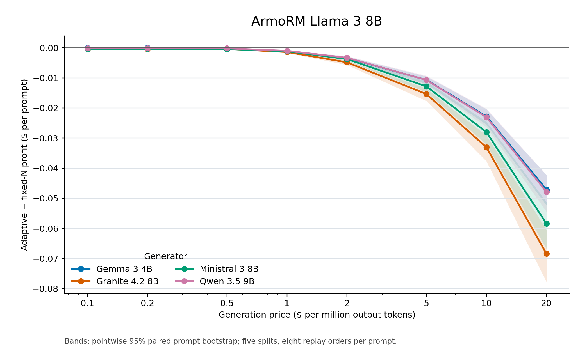
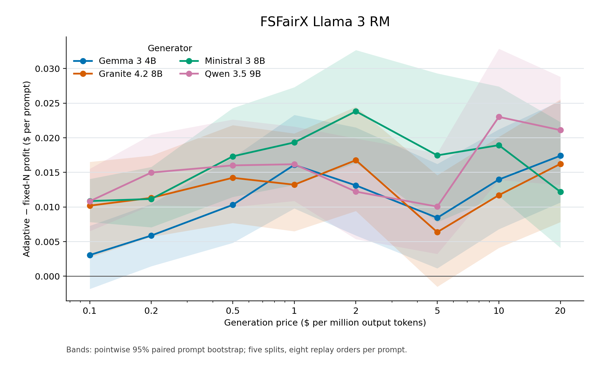
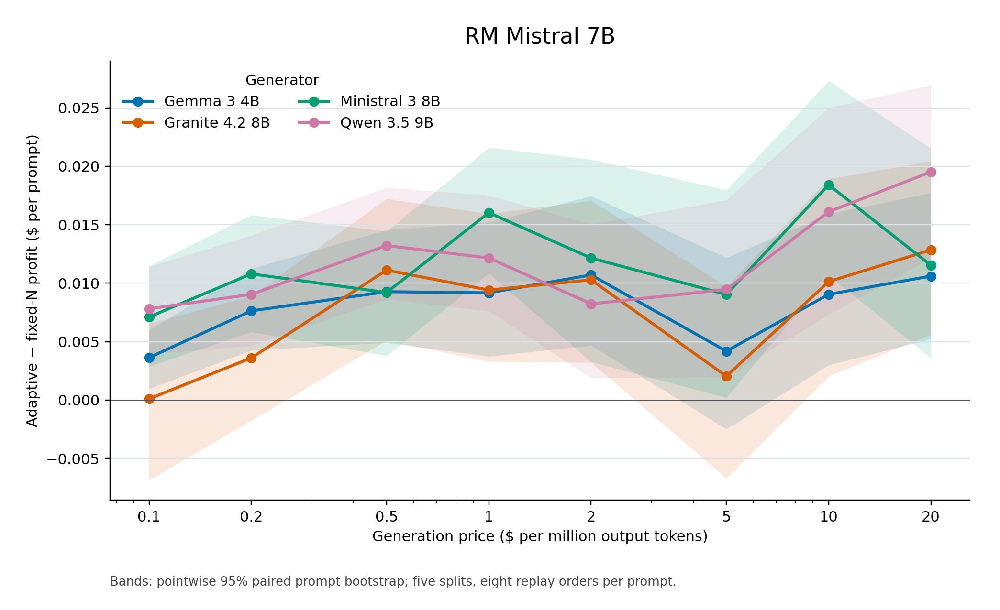
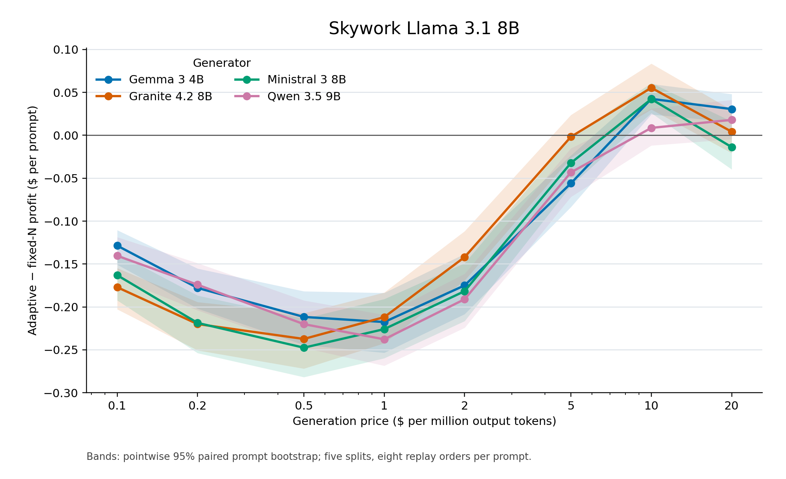

# Token-count adaptive alignment replay

Four generators, four reward models, 100 Alpaca prompts per generator, 960 cached responses per prompt, eight seeded response orders, and five 50/50 splits.

Utility is sigmoid(selected reward − that prompt's full-pool reward q99). Generation cost is recorded output tokens × the stated price; reward scoring cost is excluded. Profit is utility minus generation cost. Prices are illustrative rather than model-specific billed rates, and utility is a reward-model proxy rather than a human rating. Profit gain is adaptive minus fixed-N profit in dollars per prompt; this absolute difference stays meaningful when fixed-N profit is zero or negative.

Each table selects the generator with highest adaptive training profit within each split and price. It then selects the fixed N with highest training profit for that generator. The generator column reports the most frequent training selection; the numeric entries average the five held-out split results and can include other selected generators. Selection counts and unrounded values are in the CSV files.

Direct cost saving compares paid generation costs and may reflect a utility difference. Matched-utility saving compares with a retrospective fixed-N mixture at the attained adaptive utility; that mixture is a diagnostic, not a deployable policy.

## ArmoRM Llama 3 8B

| $/M tokens | Most selected generator | Fixed N | Fixed utility | Adaptive utility | Fixed cost ($) | Adaptive cost ($) | Fixed profit | Adaptive profit | Profit gain ($) | Direct cost saving | Matched-utility saving |
|---:|---|---:|---:|---:|---:|---:|---:|---:|---:|---:|---:|
| 0.1 | Qwen 3.5 9B | 9.8 | 0.4988 | 0.4991 | 0.00080 | 0.00125 | 0.4980 | 0.4979 | -0.00012 | -57.4% | -2.2% |
| 0.2 | Gemma 3 4B | 5.6 | 0.4983 | 0.4987 | 0.00091 | 0.00131 | 0.4974 | 0.4974 | -0.00002 | -45.3% | +6.4% |
| 0.5 | Qwen 3.5 9B | 2.6 | 0.4976 | 0.4983 | 0.00106 | 0.00206 | 0.4965 | 0.4963 | -0.00020 | -99.7% | +11.8% |
| 1 | Gemma 3 4B | 2.0 | 0.4973 | 0.4981 | 0.00162 | 0.00348 | 0.4957 | 0.4946 | -0.00104 | -114.2% | +8.2% |
| 2 | Gemma 3 4B | 1.0 | 0.4965 | 0.4981 | 0.00162 | 0.00659 | 0.4948 | 0.4915 | -0.00338 | -306.1% | +6.2% |
| 5 | Gemma 3 4B | 1.0 | 0.4965 | 0.4981 | 0.00412 | 0.01651 | 0.4924 | 0.4816 | -0.01083 | -300.7% | +1.3% |
| 10 | Gemma 3 4B | 1.0 | 0.4965 | 0.4981 | 0.00824 | 0.03294 | 0.4883 | 0.4651 | -0.02314 | -299.6% | +0.2% |
| 20 | Gemma 3 4B | 1.0 | 0.4965 | 0.4981 | 0.01649 | 0.06584 | 0.4800 | 0.4322 | -0.04780 | -299.4% | +0.0% |

## FSFairX Llama 3 RM

| $/M tokens | Most selected generator | Fixed N | Fixed utility | Adaptive utility | Fixed cost ($) | Adaptive cost ($) | Fixed profit | Adaptive profit | Profit gain ($) | Direct cost saving | Matched-utility saving |
|---:|---|---:|---:|---:|---:|---:|---:|---:|---:|---:|---:|
| 0.1 | Ministral 3 8B | 425.8 | 0.6073 | 0.6097 | 0.04310 | 0.03461 | 0.5642 | 0.5751 | +0.01086 | +18.3% | +21.2% |
| 0.2 | Ministral 3 8B | 251.2 | 0.5826 | 0.5829 | 0.05081 | 0.03996 | 0.5317 | 0.5429 | +0.01116 | +21.0% | +20.3% |
| 0.5 | Qwen 3.5 9B | 110.4 | 0.5299 | 0.5397 | 0.04770 | 0.04415 | 0.4822 | 0.4956 | +0.01340 | +4.7% | +23.5% |
| 1 | Qwen 3.5 9B | 66.4 | 0.5033 | 0.5135 | 0.05464 | 0.04858 | 0.4487 | 0.4649 | +0.01618 | +10.0% | +24.3% |
| 2 | Qwen 3.5 9B | 33.8 | 0.4646 | 0.4739 | 0.05577 | 0.05195 | 0.4088 | 0.4219 | +0.01310 | +5.9% | +19.8% |
| 5 | Qwen 3.5 9B | 17.4 | 0.4185 | 0.4104 | 0.07108 | 0.05618 | 0.3475 | 0.3542 | +0.00676 | +19.9% | +12.0% |
| 10 | Qwen 3.5 9B | 10.0 | 0.3748 | 0.3735 | 0.08176 | 0.06231 | 0.2930 | 0.3112 | +0.01823 | +22.8% | +20.9% |
| 20 | Gemma 3 4B | 4.2 | 0.3157 | 0.3440 | 0.06839 | 0.07986 | 0.2473 | 0.2642 | +0.01682 | -17.9% | +18.6% |

## RM Mistral 7B

| $/M tokens | Most selected generator | Fixed N | Fixed utility | Adaptive utility | Fixed cost ($) | Adaptive cost ($) | Fixed profit | Adaptive profit | Profit gain ($) | Direct cost saving | Matched-utility saving |
|---:|---|---:|---:|---:|---:|---:|---:|---:|---:|---:|---:|
| 0.1 | Ministral 3 8B | 549.0 | 0.6214 | 0.6083 | 0.05302 | 0.03290 | 0.5683 | 0.5754 | +0.00701 | +37.5% | +18.2% |
| 0.2 | Ministral 3 8B | 267.2 | 0.5808 | 0.5791 | 0.04955 | 0.03795 | 0.5312 | 0.5412 | +0.00992 | +22.6% | +18.3% |
| 0.5 | Qwen 3.5 9B | 112.2 | 0.5344 | 0.5449 | 0.04616 | 0.04339 | 0.4883 | 0.5015 | +0.01322 | +5.2% | +25.2% |
| 1 | Qwen 3.5 9B | 72.8 | 0.5096 | 0.5068 | 0.06012 | 0.04715 | 0.4495 | 0.4596 | +0.01016 | +21.4% | +15.7% |
| 2 | Qwen 3.5 9B | 36.0 | 0.4676 | 0.4667 | 0.05870 | 0.05023 | 0.4089 | 0.4165 | +0.00753 | +14.0% | +11.1% |
| 5 | Gemma 3 4B | 16.6 | 0.4205 | 0.4102 | 0.06757 | 0.05261 | 0.3530 | 0.3576 | +0.00466 | +22.0% | +10.1% |
| 10 | Gemma 3 4B | 8.0 | 0.3732 | 0.3743 | 0.06507 | 0.05716 | 0.3081 | 0.3171 | +0.00904 | +11.1% | +12.0% |
| 20 | Gemma 3 4B | 4.4 | 0.3341 | 0.3512 | 0.07125 | 0.07778 | 0.2628 | 0.2734 | +0.01061 | -10.1% | +14.4% |

## Skywork Llama 3.1 8B

| $/M tokens | Most selected generator | Fixed N | Fixed utility | Adaptive utility | Fixed cost ($) | Adaptive cost ($) | Fixed profit | Adaptive profit | Profit gain ($) | Direct cost saving | Matched-utility saving |
|---:|---|---:|---:|---:|---:|---:|---:|---:|---:|---:|---:|
| 0.1 | Qwen 3.5 9B | 634.2 | 0.9408 | 0.7644 | 0.05227 | 0.01261 | 0.8885 | 0.7518 | -0.13671 | +75.6% | +9.5% |
| 0.2 | Qwen 3.5 9B | 474.6 | 0.9322 | 0.6962 | 0.07809 | 0.01627 | 0.8541 | 0.6800 | -0.17412 | +79.0% | +18.7% |
| 0.5 | Gemma 3 4B | 317.6 | 0.8700 | 0.5431 | 0.12950 | 0.02574 | 0.7405 | 0.5173 | -0.22311 | +80.0% | +19.7% |
| 1 | Gemma 3 4B | 216.8 | 0.7986 | 0.4269 | 0.17668 | 0.03463 | 0.6220 | 0.3923 | -0.22970 | +80.2% | +15.2% |
| 2 | Gemma 3 4B | 140.8 | 0.6947 | 0.3265 | 0.22891 | 0.04477 | 0.4658 | 0.2817 | -0.18412 | +80.2% | +18.5% |
| 5 | Gemma 3 4B | 51.6 | 0.4281 | 0.2226 | 0.21015 | 0.06033 | 0.2180 | 0.1623 | -0.05564 | +71.1% | +22.5% |
| 10 | Gemma 3 4B | 17.4 | 0.2026 | 0.1766 | 0.14133 | 0.07289 | 0.0613 | 0.1038 | +0.04243 | +46.4% | +34.5% |
| 20 | Gemma 3 4B | 3.4 | 0.0571 | 0.1181 | 0.05538 | 0.08589 | 0.0018 | 0.0323 | +0.03051 | -68.7% | +31.0% |

Figure bands are pointwise 95% paired prompt-bootstrap percentile intervals for each generator's absolute profit gain against its own train-selected fixed N. They condition on the five splits, fixed-N choices, and the frozen adaptive rule; they are not simultaneous intervals or adjusted for policy development. Figures show all four generators, whereas tables use training-selected generators. Relative profit percentages are blank in the CSV wherever fixed-N profit is nonpositive.
