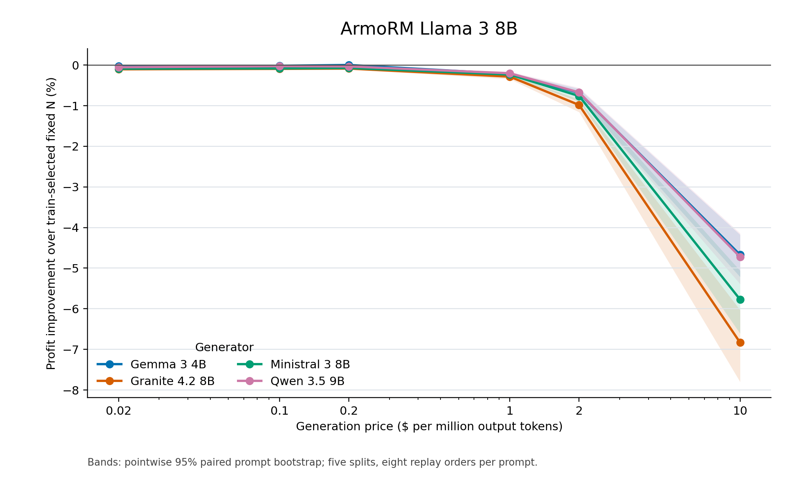
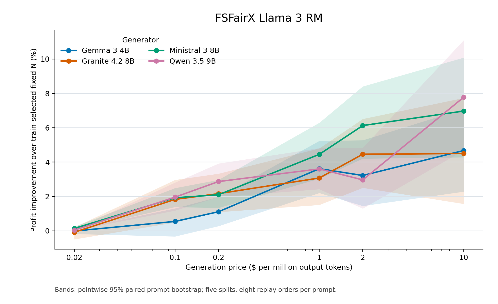
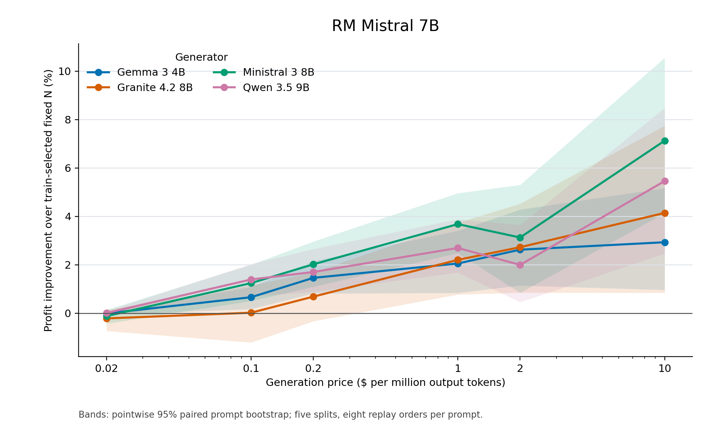
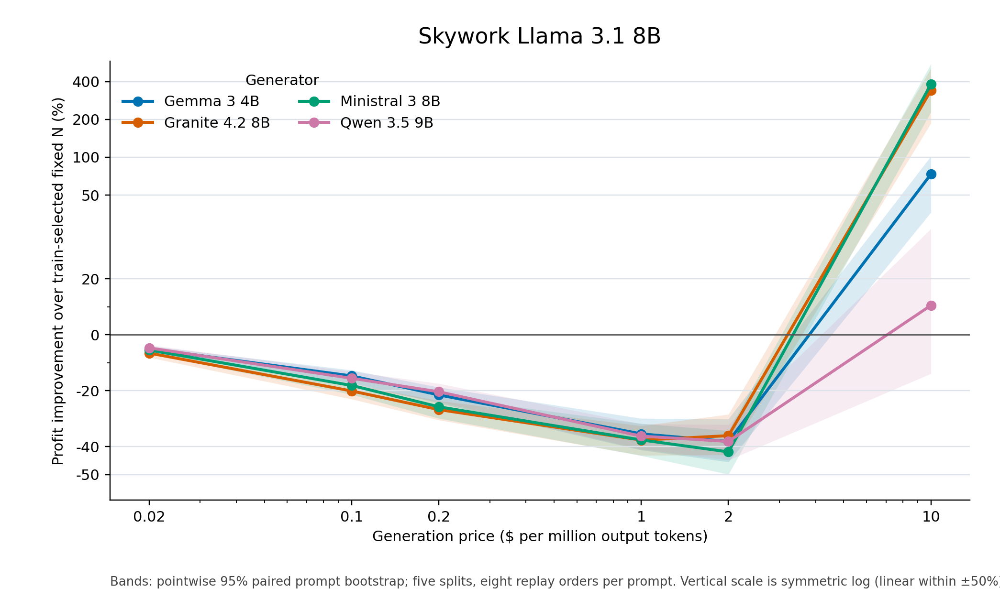

# Token-count adaptive alignment replay

Four generators, four reward models, 100 Alpaca prompts per generator, 960 cached responses per prompt, eight seeded response orders, and five 50/50 splits.

Utility is sigmoid(selected reward − that prompt's full-pool reward q99). Generation cost is recorded output tokens × the stated price; reward scoring cost is excluded. Profit is utility minus generation cost. Prices are illustrative rather than model-specific billed rates, and utility is a reward-model proxy rather than a human rating.

Each table selects the generator with highest adaptive training profit within each split and price. It then selects the fixed N with highest training profit for that generator. The generator column reports the most frequent training selection; the numeric entries average the five held-out split results and can include other selected generators. Selection counts and unrounded values are in the CSV files.

Direct cost saving compares paid generation costs and may reflect a utility difference. Matched-utility saving compares with a retrospective fixed-N mixture at the attained adaptive utility; that mixture is a diagnostic, not a deployable policy.

## ArmoRM Llama 3 8B

| $/M tokens | Most selected generator | Fixed N | Fixed utility | Adaptive utility | Fixed cost ($) | Adaptive cost ($) | Fixed profit | Adaptive profit | Profit gain | Direct cost saving | Matched-utility saving |
|---:|---|---:|---:|---:|---:|---:|---:|---:|---:|---:|---:|
| 0.02 | Gemma 3 4B | 30.6 | 0.4996 | 0.5001 | 0.00050 | 0.00114 | 0.4991 | 0.4989 | -0.03% | -130.1% | +9.9% |
| 0.1 | Qwen 3.5 9B | 9.8 | 0.4988 | 0.4991 | 0.00080 | 0.00125 | 0.4980 | 0.4979 | -0.02% | -57.4% | -2.2% |
| 0.2 | Gemma 3 4B | 5.6 | 0.4983 | 0.4987 | 0.00091 | 0.00131 | 0.4974 | 0.4974 | -0.00% | -45.3% | +6.4% |
| 1 | Gemma 3 4B | 2.0 | 0.4973 | 0.4981 | 0.00162 | 0.00348 | 0.4957 | 0.4946 | -0.21% | -114.2% | +8.2% |
| 2 | Gemma 3 4B | 1.0 | 0.4965 | 0.4981 | 0.00162 | 0.00659 | 0.4948 | 0.4915 | -0.68% | -306.1% | +6.2% |
| 10 | Gemma 3 4B | 1.0 | 0.4965 | 0.4981 | 0.00824 | 0.03294 | 0.4883 | 0.4651 | -4.74% | -299.6% | +0.2% |

## FSFairX Llama 3 RM

| $/M tokens | Most selected generator | Fixed N | Fixed utility | Adaptive utility | Fixed cost ($) | Adaptive cost ($) | Fixed profit | Adaptive profit | Profit gain | Direct cost saving | Matched-utility saving |
|---:|---|---:|---:|---:|---:|---:|---:|---:|---:|---:|---:|
| 0.02 | Ministral 3 8B | 950.4 | 0.6409 | 0.6407 | 0.02043 | 0.01934 | 0.6205 | 0.6213 | +0.14% | +5.1% | +3.2% |
| 0.1 | Ministral 3 8B | 425.8 | 0.6073 | 0.6097 | 0.04310 | 0.03461 | 0.5642 | 0.5751 | +1.93% | +18.3% | +21.2% |
| 0.2 | Ministral 3 8B | 251.2 | 0.5826 | 0.5829 | 0.05081 | 0.03996 | 0.5317 | 0.5429 | +2.10% | +21.0% | +20.3% |
| 1 | Qwen 3.5 9B | 66.4 | 0.5033 | 0.5135 | 0.05464 | 0.04858 | 0.4487 | 0.4649 | +3.61% | +10.0% | +24.3% |
| 2 | Qwen 3.5 9B | 33.8 | 0.4646 | 0.4739 | 0.05577 | 0.05195 | 0.4088 | 0.4219 | +3.21% | +5.9% | +19.8% |
| 10 | Qwen 3.5 9B | 10.0 | 0.3748 | 0.3735 | 0.08176 | 0.06231 | 0.2930 | 0.3112 | +6.22% | +22.8% | +20.9% |

## RM Mistral 7B

| $/M tokens | Most selected generator | Fixed N | Fixed utility | Adaptive utility | Fixed cost ($) | Adaptive cost ($) | Fixed profit | Adaptive profit | Profit gain | Direct cost saving | Matched-utility saving |
|---:|---|---:|---:|---:|---:|---:|---:|---:|---:|---:|---:|
| 0.02 | Granite 4.2 8B | 956.0 | 0.6524 | 0.6488 | 0.02109 | 0.01824 | 0.6314 | 0.6305 | -0.13% | +13.3% | +4.4% |
| 0.1 | Ministral 3 8B | 549.0 | 0.6214 | 0.6083 | 0.05302 | 0.03290 | 0.5683 | 0.5754 | +1.24% | +37.5% | +18.2% |
| 0.2 | Ministral 3 8B | 267.2 | 0.5808 | 0.5791 | 0.04955 | 0.03795 | 0.5312 | 0.5412 | +1.87% | +22.6% | +18.3% |
| 1 | Qwen 3.5 9B | 72.8 | 0.5096 | 0.5068 | 0.06012 | 0.04715 | 0.4495 | 0.4596 | +2.26% | +21.4% | +15.7% |
| 2 | Qwen 3.5 9B | 36.0 | 0.4676 | 0.4667 | 0.05870 | 0.05023 | 0.4089 | 0.4165 | +1.84% | +14.0% | +11.1% |
| 10 | Gemma 3 4B | 8.0 | 0.3732 | 0.3743 | 0.06507 | 0.05716 | 0.3081 | 0.3171 | +2.93% | +11.1% | +12.0% |

## Skywork Llama 3.1 8B

| $/M tokens | Most selected generator | Fixed N | Fixed utility | Adaptive utility | Fixed cost ($) | Adaptive cost ($) | Fixed profit | Adaptive profit | Profit gain | Direct cost saving | Matched-utility saving |
|---:|---|---:|---:|---:|---:|---:|---:|---:|---:|---:|---:|
| 0.02 | Qwen 3.5 9B | 951.6 | 0.9703 | 0.9154 | 0.01564 | 0.00551 | 0.9546 | 0.9099 | -4.69% | +64.7% | +12.6% |
| 0.1 | Qwen 3.5 9B | 634.2 | 0.9408 | 0.7644 | 0.05227 | 0.01261 | 0.8885 | 0.7518 | -15.38% | +75.6% | +9.5% |
| 0.2 | Qwen 3.5 9B | 474.6 | 0.9322 | 0.6962 | 0.07809 | 0.01627 | 0.8541 | 0.6800 | -20.39% | +79.0% | +18.7% |
| 1 | Gemma 3 4B | 216.8 | 0.7986 | 0.4269 | 0.17668 | 0.03463 | 0.6220 | 0.3923 | -36.91% | +80.2% | +15.2% |
| 2 | Gemma 3 4B | 140.8 | 0.6947 | 0.3265 | 0.22891 | 0.04477 | 0.4658 | 0.2817 | -39.47% | +80.2% | +18.5% |
| 10 | Gemma 3 4B | 17.4 | 0.2026 | 0.1766 | 0.14133 | 0.07289 | 0.0613 | 0.1038 | +73.35% | +46.4% | +34.5% |

Figure bands are pointwise 95% paired prompt-bootstrap percentile intervals for each generator's profit improvement against its own train-selected fixed N. They condition on the five splits, fixed-N choices, and the frozen adaptive rule; they are not simultaneous intervals or adjusted for policy development. Bootstrap profit differences are divided by the observed positive fixed-N profit to avoid singular resampled ratios near zero. Figures show all four generators, whereas tables use training-selected generators. Skywork uses a symmetric-log vertical scale because several fixed-N profits approach zero at $10/M tokens.
